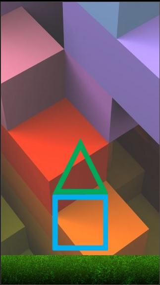

# DropForms

## Sumário

* [Enredo](#enredo)
* [Objetivos](#objetivos)
* [Regras do Jogo](#regras-do-jogo)
* [Tecnologias Utilizadas](#tecnologias-utilizadas)

# Enredo
 O jogo é baseado na ideia de que o usuário deve saber diferenciar as formas geométricas e cores respectivamente aleatórios.

# Objetivos

* Mudar as formas geométricas através do toque na própria forma mostrada na tela para que ela coincida com a que está em queda.

# Regras do Jogo
* Ganha um ponto a cada acerto.
* Perde uma tentativa a cada erro.
* 5 tentativas no total.

# Tecnologias Utilizadas

* Lua
* Corona SDK
